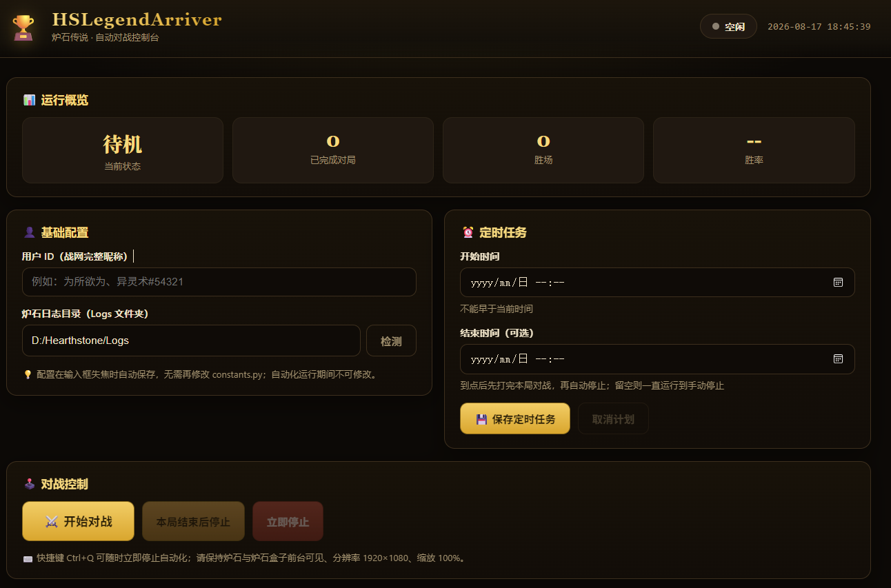

<div align="center">

# 🏆 HSLegendArriver（胜率63.8的炉石传说脚本）

### 帮你走完上传说的路

**读取炉石日志 + 获取炉石盒子打法建议 + 自动执行操作**

**33 分钟：钻石 2 → 传说**  
**一下午：冲到传说约 6000 名**  
**多盘实测：弃牌术整体胜率 63.8%，与人工打胜率几乎相差无几**

<br>

> 🔥 已实测支持：**弃牌术 / 海盗瞎**  
> 🤖 自动识别对局、读取推荐打法并完成出牌操作

</div>

---

## ✨ 项目简介

**HSLegendArriver（传说到达者）** 是一个用于《炉石传说》的自动化打法执行器。

项目通过读取炉石对局日志，并结合 **炉石盒子「推荐打法」** 提供的推荐操作，自动识别当前对局状态并执行对应的鼠标点击与键盘操作。

简单来说：

> **炉石盒子负责告诉你“怎么打”，HSLegendArriver 负责帮你“打出去”。**

目前已经使用 **弃牌术** 和 **海盗瞎** 进行了实际天梯测试。


---


## 🚀 快速开始

只需要 **2 步**。

### 1️⃣ 打开炉石与炉石盒子

启动：

- 《炉石传说》
- 《炉石传说盒子》


在卡组列表中选择需要运行的卡组，例如：

**弃牌术**


---

### 2️⃣ 启动程序

下载release版本后双击启动.bat

浏览器会自动打开web控制台
## 🖥️ Web 控制台（可选定时执行对战）

请修改以下配置：

#### `YOUR_NAME`

填写你的完整炉石 BattleTag：

```python
YOUR_NAME = "用户名#编号"
```

例如：

```python
YOUR_NAME = "为所欲为、异灵术#54321"
```

---

---
### 游戏界面

### 页面功能

| 功能 | 说明 |
| --- | --- |
| 👤 基础配置 | 填写用户 ID（完整战网昵称）与炉石日志目录，失焦自动保存并立即生效 |
| ⚔️ 开始对战 | 一键立即启动自动化对战 |
| ⏰ 定时任务 | 设置开始 / 结束时间；**开始时间不能早于当前时间**，到达结束时间后**先打完本局对战再自动停止** |
| 🛑 停止控制 | 「本局结束后停止」与「立即停止」两种方式；Ctrl+Q 亦可立即停止 |
| 📊 运行概览 | 实时显示对局数、胜场、胜率与当前状态 |
| 📜 实时日志 | 页面内实时查看自动化运行日志 |

> ⚠️ 定时任务期间请保持控制台程序运行（浏览器可以关闭，重开页面即可看到状态）。

---


## ⚠️ 启动前检查

如果程序出现点击位置错误，请优先确认以下设置。
- [ ] 盒子推荐打法位于屏幕左侧
- [ ] Windows 桌面分辨率为 **1920 × 1080**
- [ ] 炉石传说分辨率为 **1920 × 1080**
- [ ] Windows 显示缩放为 **100%**
- [ ] 炉石使用全屏窗口 / 全屏显示
- [ ] 炉石盒子左侧「推荐打法」完整显示
- [ ] 炉石盒子使用 **简体中文**
- [ ] 炉石 / 炉石盒子窗口未被其他窗口遮挡
- [ ] `HEARTHSTONE_LOG_ROOT` 配置正确
- [ ] `YOUR_NAME` 配置正确

---


## 🃏 已测试卡组

### ✅ 弃牌术

目前测试最充分的卡组之一。

卡组代码：

```text
AAEBAa35AwaPggPV0QP5xgXxoQb2oQbGsgcMzge1uQPQ4QOYkgWrkgWVygbXlweEmQekrQfWvgfZvgfPvwcAAA==
```

### ✅ 海盗瞎

已完成实际对局测试，个人认为可以正常执行打法。

---


## 🤝 Contributing

如果你在使用过程中遇到问题，或者有功能建议，**欢迎直接提交 Issue**。

建议在 Issue 中尽量提供：

- 🐛 **Bug 反馈以及游戏界面运行截图**：说明问题现象、复现步骤和运行环境附上运行截图
- 💡 **功能建议**：描述希望支持的功能或使用场景
- 🃏 **卡组适配**：注明卡组名称、相关交互以及异常情况
- 🖼️ **界面问题**：如涉及点击坐标或 UI 变化，建议附截图


---

## ⭐

如果这个项目：

- 让你觉得有意思
- 给了你一些自动化 / 炉石 AI 的灵感

欢迎点一个 **Star ⭐**，这对我真的很重要！！！

你的 Star 会让我知道还有人在使用这个项目，也会成为继续适配新版本和新卡组的动力。

> **如果真的靠它上传说了，回来留个 Star 吧 😎**

---

## 🙏 致谢

本项目参考了以下开源项目：

- [Yiyuan-Dong/AutoHS](https://github.com/Yiyuan-Dong/AutoHS)
- [FallAbyss/AutoHS](https://github.com/FallAbyss/AutoHS)

感谢原作者们提供的思路和开源代码。

---

## ⚠️ Disclaimer

本项目仅用于 **技术研究与代码交流**。


---

<div align="center">

### 🏆 HSLegendArriver

**让 AI 帮你走完最后一段上传说的路。**

如果你觉得这个项目有意思：

## ⭐ Star 一下吧 ⭐

</div>
